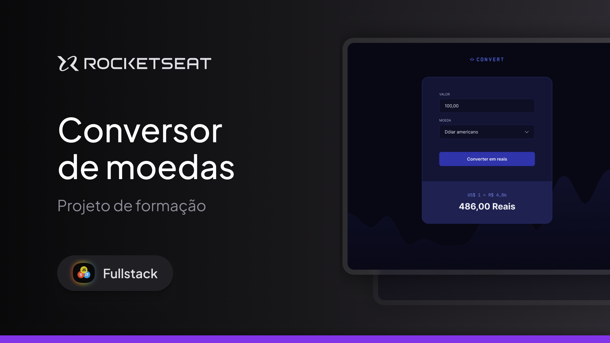

  

<h1 align="center"> Conversor de Moedas </h1>

Programa exclusivo no curso Full-Stack, promovido pela Rocketseat para ensino de tecnologias WEB, no Modulo JavaScript, realizado junto com intrutor, foi aplicado o Conceito JavaScript para converte a moeda para Real, moedas EUA, EURO e Libra.

  <a href="#-tecnologias">Tecnologias</a>&nbsp;&nbsp;&nbsp;|&nbsp;&nbsp;&nbsp;
  <a href="#-Projeto">Projeto</a>&nbsp;&nbsp;&nbsp;  

 

  

## 🚀 Tecnologias

Esse projeto foi desenvolvido com as seguintes tecnologias:

- HTML e CSS
- JavaScript
- Git e Github

## 💻 Projeto

Voce pode visualizar o projeto pronto projeto através [DESSE LINK](https://ricardotavaresdias.github.io/CONVERT-TEMPLATE/)
O Projeto Conversor de Moedas é um agregador de ensino na Rocketseat para avançar o conhecimento em JavaScript. Nesse modulo foi aplicado o conceito de Conversor de Moedas e validando e covertendo moedas em JavaScript.

---

Rocketseat: [Participe da nossa comunidade!](https://www.rocketseat.com.br/)
